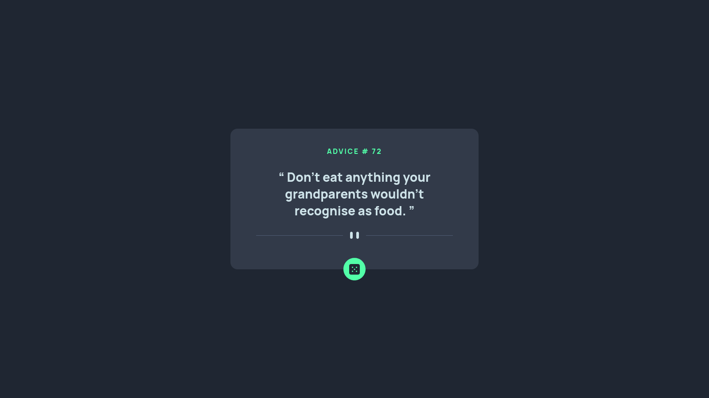

# Frontend Mentor - Advice generator app solution

This is a solution to the [Advice generator app challenge on Frontend Mentor](https://www.frontendmentor.io/challenges/advice-generator-app-QdUG-13db). Frontend Mentor challenges help you improve your coding skills by building realistic projects.

## Table of contents

- [Frontend Mentor - Advice generator app solution](#frontend-mentor---advice-generator-app-solution)
  - [Table of contents](#table-of-contents)
  - [Overview](#overview)
    - [The challenge](#the-challenge)
    - [Screenshot](#screenshot)
    - [Links](#links)
  - [My process](#my-process)
    - [Built with](#built-with)
    - [What I learned](#what-i-learned)
    - [Continued development](#continued-development)
  - [Author](#author)
  - [Acknowledgments](#acknowledgments)

## Overview

### The challenge

Users should be able to:

- Click: the roll Button to get a random advice
- See errors: If and error happened it will have feedback
- Hover: to see the button's hover state

### Screenshot

### Links

- Solution URL: [Here](https://github.com/AbdoArafh/advice-generator)
- Live Site URL: [Here](https://abdoarafh.github.io/advice-generator/)

## My process

### Built with

- Semantic HTML5 markup
- CSS custom properties
- CSS Grid
- Desktop-first workflow
- [Advice Slip API](https://api.adviceslip.com)

### What I learned

If we get to what I learned.
I learned to make more responsive designs and work with
colors better.

### Continued development

To make more responsive designs to work on all device sizes.

## Author

- Frontend Mentor - [@AbdoArafh](https://www.frontendmentor.io/profile/AbdoArafh)
- Twitter - [@abdoarafh](https://www.twitter.com/abdoarafh)

## Acknowledgments

Thank you for frontend mentor for the design and idea